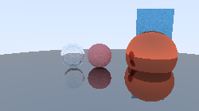
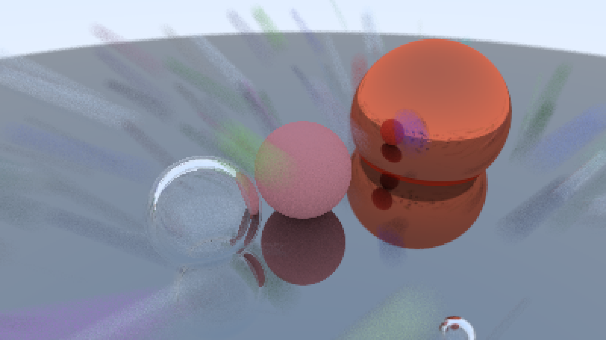
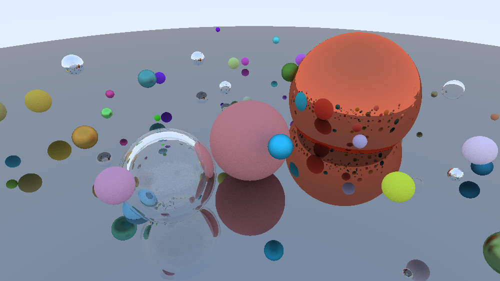
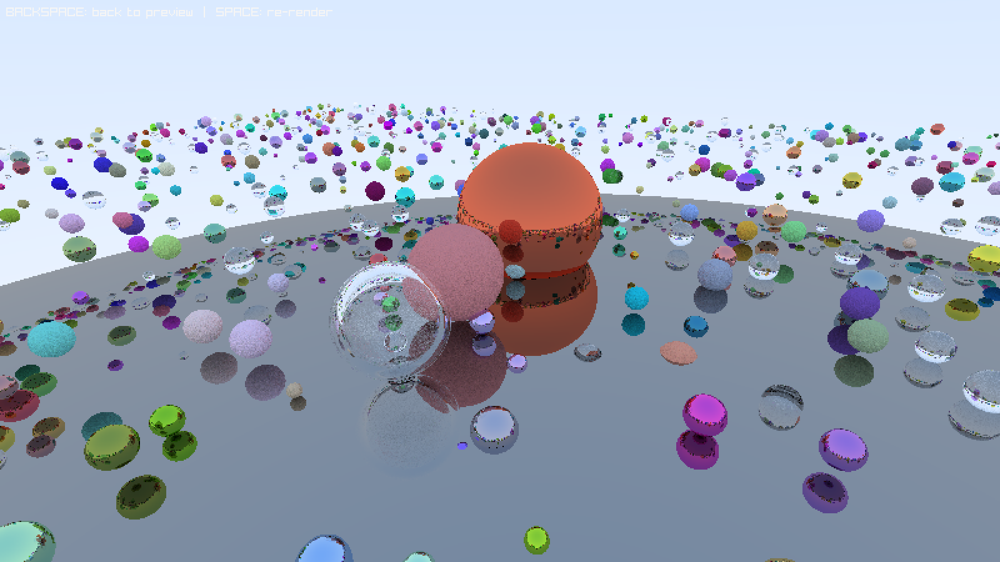
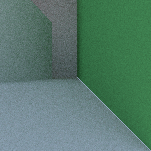
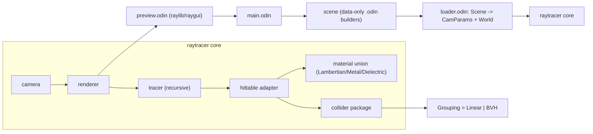

# Odin Raytracer

A CPU path tracer written in [Odin](https://odin-lang.org/), based on the
[_Ray Tracing in One Weekend_](https://raytracing.github.io/) book series,
with an interactive raylib/raygui front-end for changing camera parameters and
comparing acceleration structures in real time.

## Table of Contents

- [The Books](#the-books)
- [Render Gallery](#render-gallery)
- [Progress & Todo](#progress--todo)
  - [Book 1 — Ray Tracing in One Weekend](#book-1--ray-tracing-in-one-weekend)
  - [Book 2 — Ray Tracing: The Next Week](#book-2--ray-tracing-the-next-week)
  - [Book 3 — Ray Tracing: The Rest of Your Life](#book-3--ray-tracing-the-rest-of-your-life)
  - [Beyond the Books (engine improvements)](#beyond-the-books-engine-improvements)
- [Building & Running](#building--running)
  - [Controls](#controls)
  - [Scenes](#scenes)
  - [Render artifacts](#render-artifacts)
- [Architecture](#architecture)
  - [Module overview](#module-overview)
  - [Layout decisions](#layout-decisions)
- [Known limitations & notes](#known-limitations--notes)

## The Books

The renderer follows this free book series:

1. [Ray Tracing in One Weekend](https://raytracing.github.io/books/RayTracingInOneWeekend.html)
2. [Ray Tracing: The Next Week](https://raytracing.github.io/books/RayTracingTheNextWeek.html)
3. [Ray Tracing: The Rest of Your Life](https://raytracing.github.io/books/RayTracingTheRestOfYourLife.html)

Source: [raytracing.github.io](https://raytracing.github.io/) ·
[GitHub repo](https://github.com/RayTracing/raytracing.github.io)

## Render Gallery

| Render | Description |
| --- | --- |
|  | **Basic scene** — hollow-glass bubble (negative-radius trick via nested dielectric), Lambertian and metal spheres, plus the first quad primitive. 28 ms. |
|  | **Defocus blur** — thin-lens depth of field: the focal plane sits on the mirror ball while the rest smears with aperture size. |
|  | **Complex scene** — 100+ random spheres of mixed material on a mirror ground; the RTOW "final scene" equivalent. 5.6 s through the BVH. |
|  | **Many-object stress test** — book-cover-style field of hundreds of spheres; what the BVH is for. |
|  | **Cornell box** — correct closed-box geometry with rotated cuboids and a light panel, but no emissive material yet, so the interior is only lit by the sky gradient leaking “through” the box. Lights are the top todo. |

More renders (including Linear-vs-BVH timing runs) live in `rendered/`; every
filename encodes `scene_grouping_render_<ms>ms_<ns>.png`, so the directory is
also a crude benchmark history.

## Progress & Todo

### Book 1 — Ray Tracing in One Weekend

Status: **complete.**

- [x] `Vec3` / `Point3` / `Color` math (`core:math` + custom helpers)
- [x] Rays and a parametric camera with viewport/pixel-delta setup
- [x] Sphere intersection with front/back-face normal handling
- [x] Antialiasing via random per-pixel jitter
- [x] Lambertian (cosine-ish hemisphere scatter), Metal (reflection + fuzz),
      Dielectric (Snell, total internal reflection, Schlick approximation)
- [x] Hollow-glass bubble (inverted-normals sphere)
- [x] Positionable camera with configurable vertical FOV, look-at and ratio
- [x] Defocus blur (thin lens, random disk sampling)
- [x] Gamma correction (linear → sqrt)
- [x] Background sky gradient
- [x] The random-sphere "final scene" (`complex_scene`)

### Book 2 — Ray Tracing: The Next Week

Status: **geometry and acceleration are complete; shading, lights, and textures remain.**

- [x] **Motion blur (infrastructure)** — rays carry `time`, spheres have
      origin + direction, AABBs are extended over the motion interval. The
      demo scenes currently use ~zero motion, so the effect is wired but not
      showcased.
- [x] **BVH** — longest-axis split build, slab AABB test, runtime-switchable
      against the brute-force `LinearGrouping` (press `G`).
- [x] **Quads** — parallelogram primitive with plane + α/β containment test.
- [x] **Boxes from quads** — `append_cuboid` bakes 6 faces, with Y-rotation
      and translation baked in at scene-build time (Cornell cuboids).
- [x] **Cornell box geometry** (`cornell_scene`) including light-panel quad.
- [ ] **Emissive/diffuse light materials** — *the* missing piece for proper
      soft shadows and global illumination; the Cornell box needs it.
- [ ] Solid (checker) textures — materials take plain albedo only.
- [ ] Image textures (uv-mapping, texture sampling).
- [ ] Perlin noise (marble/turbulence).
- [ ] First-class instancing (`translate`/`rotate` hittable wrappers) — today
      rotation/translation is baked into quad vertices at scene build time.
- [ ] Constant medium / participating media (smoke, fog).

### Book 3 — Ray Tracing: The Rest of Your Life

Status: **not started.**

- [ ] Monte Carlo integration groundwork (explicit PDF sampling).
- [ ] Importance sampling / light sampling (direct-light PDFs).
- [ ] Cosine-weighted PDF for Lambertian scatter.
- [ ] Hittable PDFs, mixture densities, next-event estimation.
- [ ] Convergence improvements needed to render the Cornell box in seconds
      instead of minutes.

### Beyond the Books (engine improvements)

- [ ] Progressive / accumulating rendering (average frames as the camera moves).
- [ ] JSON scene loading (`base_scene.json` is an empty stub; scenes are
      compiled in today).
- [ ] Triangle meshes (OBJ loading), which also enables real model imports.
- [ ] Per-pixel SIMD & batched SoA hit testing.
- [ ] Render-statistics overlay (MRays/s, per-partition timings).
- [ ] Headless CLI render mode (no window) for benchmarking.
- [ ] Tone mapping beyond sqrt-gamma (Reinhard/ACES), firefly clamping.

## Building & Running

Requires the [Odin compiler](https://odin-lang.org/) (`dev-2025-xx` or newer
should work); raylib is vendored through `vendor:raylib`, nothing else to install.

```sh
# Optimized build (matches .vscode/tasks.json)
odin build ./src -out:main -o:aggressive -microarch:native -no-bounds-check -disable-assert

# Run
./main
```

### Controls

The app opens a raylib window with an orbitable 3D wireframe preview of the
scene (spheres, quads, and the tracer camera's position + image plane) and a
raygui camera panel.

| Input | Action |
| --- | --- |
| Left drag | Orbit preview camera |
| Mouse wheel | Zoom preview |
| Sliders | Change camera position / look-at / vfov / defocus / samples / depth |
| `SPACE` | Run the (blocking) raytraced render with the current settings |
| `G` | Rebuild acceleration structure, toggling Linear ↔ BVH |
| `BACKSPACE` | Back from the rendered image to the preview |

### Scenes

Scenes are plain data builders in `src/scene/scene.odin`; select one in
`src/main.odin`:

| Factory | Contents |
| --- | --- |
| `basic_scene()` | Ground + 4 test spheres + one quad — fast sanity check |
| `cornell_basic_scene()` | Same layout, camera tuned differently |
| `materials_scene()` | One sphere per material type, aligned |
| `defocus_scene()` | Objects at 3 depths to tune aperture/focus |
| `random_scene(n)` | Ground + random n×n sphere grid |
| `complex_scene()` | Random grid + the material-test spheres (default in `main`) |
| `cornell_scene()` | Full Cornell box: walls, light panel, 2 rotated cuboids |

### Render artifacts

Each render is written once (never overwritten) to
`rendered/<scene>_<GroupingKind>_render_<ms>ms_<ns-timestamp>.png`, so a folder
listing is a self-describing benchmark log. `main` renders at 4000 px wide,
RGBA, `upscale = 1.0`; the preview re-renders at whatever resolution the
window holds.

## Architecture



### Module overview

| Path | Role |
| --- | --- |
| `src/main.odin` | Entry point: pick scene → build world → start interactive preview |
| `src/scene/scene.odin` | Data-only scene description (`SceneObject`, `SceneQuad`, `SceneCamera`) — plain `[3]f64`, no renderer types |
| `src/raytracer/loader.odin` | Translates the scene description into `CamParams` + `World`, enforcing the "spheres before quads" id invariant |
| `src/raytracer/raymath/` | `Vec3`/`Point3`/`Ray` types and math (reflect, refract, random unit vectors …) |
| `src/raytracer/collider/` | Geometry & acceleration: `SphereCollider`, `QuadCollider`, `Aabb`, `Grouping` (`LinearGrouping` | `Bvh`) |
| `src/raytracer/hittable.odin` | Adapter: turns a `collider.HitRecord` into a `raytracer.HitRecord` with the material from the parallel materials array |
| `src/raytracer/material.odin` | `Material` union + per-type `*_scatter` procs |
| `src/raytracer/camera.odin` | Viewport setup, defocus-disk sampling, per-pixel ray generation |
| `src/raytracer/tracer.odin` | The recursive path: hit → scatter → attenuate |
| `src/raytracer/renderer.odin` | Image partitioning + thread-pool fan-out into the RGBA buffer |
| `src/raytracer/color.odin` | Gamma + buffer packing |
| `src/preview.odin` | raylib 3D preview, raygui camera sliders, render saving |
| `src/utils/` | Generic `Interval(T)`, median-of-durations stat, thread-pool helper, degrees→radians |

### Layout decisions

- **Scene vs. World separation.** Scenes are pure data (`[3]f64`, enums,
  strings) that know nothing about colliders, bboxes or materials; `loader`
  performs the one-way conversion. This keeps scene files readable and leaves
  room for JSON loading without touching the raytracer.
- **Geometry in SoA collider storage.** Spheres and quads each live in a
  `#soa[dynamic]` array inside a single `ColliderSpace`, and every primitive
  carries its own `Aabb`. Global primitive ids are *spheres first, then quads*
  — the same index addresses `world.materials`. No per-object pointers or
  polymorphic interfaces.
- **Acceleration structure as a strategy, not a base class.** `Grouping` is a
  `#no_nil` tagged union (`LinearGrouping | Bvh`) with a single `hit_objects`
  dispatch and a `grouping_build(space, kind)` rebuild entry point. That makes
  the `G` key A/B benchmark a 3-line change and keeps the BVH opt-in.
- **Flat BVH over an index permutation.** The build only reorders
  `bvh.indices`; the collider arrays never move, so rebuilding is allocation-
  light and the existing material indexing keeps working. Nodes are a flat
  `[dynamic]BvhNode` array (arena-style), not a pointer tree.
- **Materials as a tagged union.** `Material` is an Odin `union` of the three
  material structs; scatter dispatch is a single `switch`. Small, exhaustive,
  zero-allocation — adding a texture-backed or emissive material means one
  more variant and one more case.
- **Separation of package responsibilities.** `collider` knows rays and boxes
  but *not* materials; `raytracer` knows materials but delegates all
  ray-vs-geometry to `collider` through one adapter (`hittable.odin`). The
  BVH/`Aabb` work can therefore be tested and benchmarked without any shading.
- **CPU, f64, straightforward scalar code** for now: the hot path relies on
  `-o:aggressive -microarch:native -no-bounds-check` and thread-pool image
  partitioning (default 16 partitions) rather than SIMD intrinsics.
- **Adaptive preview costs.** The raylib preview draws big spheres properly,
  tiny grid spheres as cubes, and the giant ground sphere as a wireframe. This
  keeps the 3D preview interactive with hundreds of objects.

## Known limitations & notes

- The color pipeline is the books' sqrt-gamma approximation; there is no tone
  mapping, and `RGBA8888` is the only output format.
- The Cornell box render looks "ambient-lit" because emissive materials are
  not implemented — the light-panel quad is currently just a white Lambertian
  ceiling patch. Emissive materials are the first todo item.
- Rendering is CPU-single-buffered and fully blocking on `SPACE`; long renders
  freeze the window. A "Rendering…" frame is flushed first so the window shows
  the rendering state.
- Interactive preview camera (slider-driven) rebuilds the tracer camera
  immediately, which is fine, but there is no undo/fly-mode. This keeps the
  loop simple while the books take priority.
